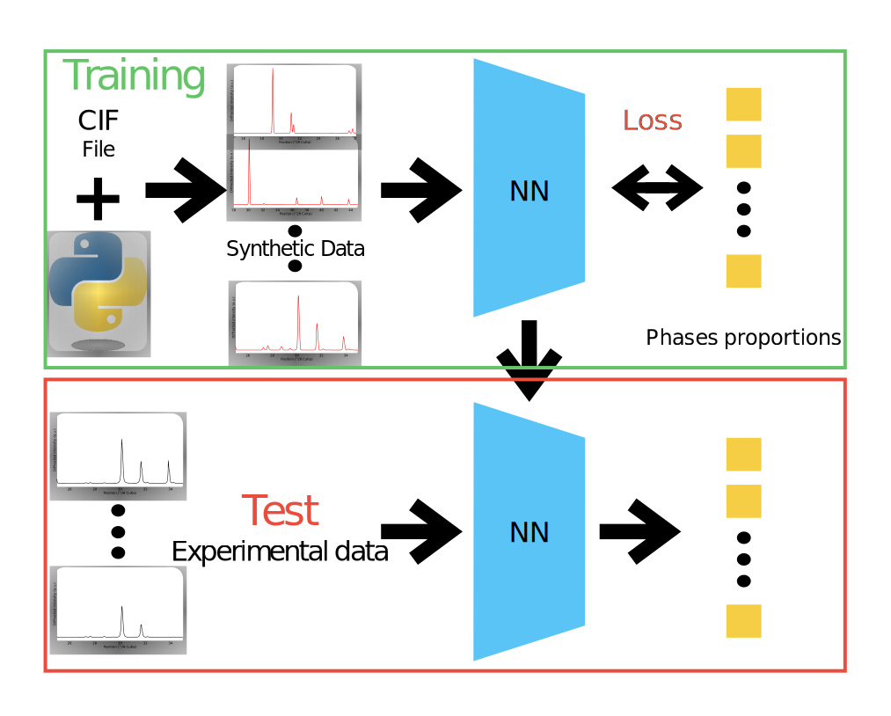

# Deep neural network method for mineral phases quantification using XRD patterns

## Abstract
We propose a method to quantify the mineral phases of a material sample using the X-Ray diffraction patterns. 
This is a two steps method. 
1. We first train a Neural Network (NN) using synthetic data. 
1. Then, recovering the trained NN we are able to test the method with 32 experimental data. 



## Prerequisites

- python 3.9.7
- pytorch 1.10.1
- [crystals](https://crystals.readthedocs.io/en/master/index.html) 1.4.0
- [PyCifRW](https://pypi.org/project/PyCifRW/4.1/) 4.4.6

## Getting started

### 1 - Clone repository 
```
git clone https://github.com/titouansimonnet/XRD_Proportion_Inference

cd XRD_Proportion_Inference
```
- XRD_proportion_Inference
  - Databases
    - Experimental
    - Single_phase
    - Mix_norm
  - Simulation_XRD_patterns
  - Neural_network


### 2 -  Set environnement
We use a local conda virtual environnement 

```
conda create -n XRD
source activate XRD 
```

Install dependencies

```
conda install python=3.9.7
conda install pytorch==1.10.1 torchvision==0.11.2 torchaudio==0.10.1 -c pytorch
conda install -c conda-forge crystall=1.4.0
conda install -c anaconda pandas=1.3.4
```

Alternately, it is possible to create the virtual environnement on a remote server

```
python -m vend XRD
```

## Use the code

The databases used in the article are available. They include synthetic single phases, multicoumpounds and 32 experimental XRD patterns. 

```
cd Neural_network
```

In the Neural_network folder you will find the test.py file. It allows to test the trained (on synthetic database) Neural Network available in the same folder (NN_trained_database2). This network is trained as presented in the article. 

## Train the Neural network yourself
### 1 - Generate synthetic single phase XRD patterns

```
cd Simulation_XRD_patterns
python Mineral_phase_generation.py
```
Here is an example in order to generate a single phase XRD pattern for Calcite. Others single phases XRD pattern can be generated by recovering CIF file on [AMSCD](http://rruff.geo.arizona.edu/AMS/amcsd.php), and then by changing the parameters 'name' in the Python script.
The wavelength function (for  Bruker D8 diffractometer equipped with a LynxEye XE detector and a Cu anode (1.5418)) is include on the simulation code.

### 2 - Generate multicompounds XRD patterns database

First, apply the attenuation factor correction.

```
python attenuation_factor.py
```

```
python Mix_data.py
python Norm.py
```


Then, create linear mixture of single phase XRD patterns in order to create synthetic database with multicompounds XRD patterns. 
Train, validation and test set can be generate using the Python code.
The synthetic data need to be normalize with maximum = 1 before to train the NN.


### 3 - Train the Neural Network

Update the path for the training set before use the following commands.

```
cd ..
cd Neural_network
python train.py
```

